# 📅 Cronograma del Proyecto
## Diagrama de Gantt — OmniHear (Incremental)

```mermaid
gantt
    title Cronograma - Proyecto OmniHear
    dateFormat  YYYY-MM-DD
    excludes    weekends

    section 1. Prospecto
    Definir requerimientos funcionales           :t111, 2026-06-01, 3d
    Definir requerimientos no funcionales        :t112, 2026-06-04, 3d
    Generar propuesta técnica                    :t12,  2026-06-09, 5d
    Administrar la configuración                 :t13,  2026-06-17, 3d
    Generar propuesta económica                  :t14,  2026-06-22, 4d
    Estimar costos y presupuesto preliminar      :t141, 2026-06-26, 2d
    Planificar e identificar riesgos iniciales   :t15,  2026-06-30, 5d
    Validar propuestas                           :t16,  2026-07-07, 2d
    Hito - Acta de constitución aprobada         :milestone, m1, after t16, 0d

    section 2. Planificación
    Elaborar cronograma detallado (Gantt)        :t21,  2026-07-10, 3d
    Definir entregables                          :t22,  2026-07-15, 3d
    Relevar normas y regulaciones                :t23,  2026-07-15, 3d
    Relevar aspectos legales                     :t24,  2026-07-15, 3d
    Diseñar itinerario terapéutico               :t25,  2026-07-15, 7d
    Actualizar matriz de riesgos (I)             :t26,  2026-07-24, 1d
    Realizar reunión de Kickoff                  :t27,  2026-07-27, 1d
    Hito - Planificación aprobada                :milestone, m2, after t27, 0d

    section 3. Diseño
    Definir requisitos del software              :t311, 2026-07-27, 4d
    Diseñar arquitectura                         :t312, 2026-07-31, 6d
    Diseñar casos de prueba                      :t313, 2026-08-10, 4d
    Seleccionar entorno cloud                    :t321, 2026-08-14, 2d
    Definir políticas de backup                  :t322, 2026-08-19, 1d
    Definir seguridad y acceso                   :t323, 2026-08-20, 5d
    Definir escalabilidad y mantenimiento        :t324, 2026-08-27, 2d
    Revisar aspectos técnicos de diseño          :t33,  2026-08-31, 2d
    Hito - Validación del diseño                 :milestone, m3, after t33, 0d

    section 4. Desarrollo
    Configurar el entorno cloud                  :t411, 2026-09-02, 3d
    Desplegar base de datos                      :t412, 2026-09-07, 3d
    Configurar servidores y almacenamiento       :t413, 2026-09-10, 2d
    Codificar interfaz UX/UI                     :t42,  2026-09-14, 8d
    Codificar módulo de registro y perfil        :t431, 2026-09-24, 4d
    Codificar módulo de conversación             :t436, 2026-09-29, 22d
    Codificar módulo de calibración              :t432, 2026-09-24, 13d
    Codificar módulo de discriminación de fonemas :t434, 2026-09-24, 18d
    Codificar módulo de sonidos                  :t433, 2026-11-11, 9d
    Codificar módulo de reconocimiento palabras  :t435, 2026-11-17, 13d
    Actualizar matriz de riesgos (II)            :t437, 2026-12-11, 2d
    Crear manuales                               :t44,  2026-12-15, 6d
    Realizar pruebas de desarrollo (caja blanca) :t451, 2027-01-06, 6d
    Realizar testing unitario                    :t452, 2027-01-14, 5d
    Smoke testing (cada incremento)              :t453, 2027-01-21, 2d
    Depurar errores                              :t46,  2027-01-25, 7d
    Integrar módulos                             :t47,  2027-02-03, 11d
    Hito - Versión funcional integrada           :milestone, m4, after t47, 0d

    section 5. Verificación y Validación
    Realizar pruebas de integración (caja negra) :t511, 2027-02-22, 8d
    Registrar y depurar errores                  :t512, 2027-03-04, 3d
    Revalidar el sistema                         :t513, 2027-03-09, 5d
    Realizar smoke testing final                 :t514, 2027-03-16, 2d
    Medir niveles de audio                       :t521, 2027-03-18, 4d
    Verificar frecuencia y dB                    :t522, 2027-03-25, 4d
    Verificar seguridad técnica y datos          :t523, 2027-03-25, 5d
    Certificar seguridad técnica                 :t524, 2027-04-05, 3d
    Evaluar con especialistas                    :t531, 2027-04-08, 7d
    Revisar eficacia terapéutica                 :t532, 2027-04-19, 5d
    Realizar ajustes finales                     :t533, 2027-04-26, 6d
    Certificar clínicamente el sistema           :t534, 2027-05-04, 3d
    Recopilar dossier de diseño y fabricación    :t541, 2027-05-07, 11d
    Consolidar evidencia de validación           :t542, 2027-05-24, 8d
    Generar solicitud de registro ANMAT          :t543, 2027-06-04, 6d
    Presentar documentación regulatoria          :t544, 2027-06-14, 13d
    Hito - Sistema validado y habilitado         :milestone, m5, after t544, 0d

    section 6. Entrega Final
    Realizar análisis de mercado                 :t611, 2027-06-14, 4d
    Generar estrategia comercial                 :t612, 2027-06-18, 3d
    Desarrollar campaña de difusión              :t613, 2027-06-24, 5d
    Definir vinculaciones con obras sociales     :t614, 2027-07-02, 6d
    Desarrollar estrategias de implementación    :t615, 2027-07-13, 3d
    Entregar manual de usuario                   :t621, 2027-07-16, 1d
    Entregar documentación técnica               :t622, 2027-07-19, 3d
    Entregar documentación normativa             :t623, 2027-07-22, 2d
    Entregar documentación contractual           :t624, 2027-07-26, 2d
    Entregar formalmente el producto             :t625, 2027-07-28, 1d
    Hito - Producto final entregado              :milestone, m6, after t625, 0d

    section 7. Cierre
    Cerrar contrato                              :t711, 2027-07-29, 2d
    Validar entregables finales                  :t712, 2027-08-02, 2d
    Aprobar formalmente el cierre                :t713, 2027-08-04, 1d
    Realizar reunión de cierre y lecciones       :t72,  2027-08-05, 1d
    Hito - Acta de cierre firmada                :milestone, m7, after t72, 0d
```

## Tabla de Tareas

| ID | Tarea | Esfuerzo (hs) | Duración (días) | Inicio | Fin | Paralela con | Hito |
|----|-------|:---:|:---:|--------|-----|---|:---:|
| 1.1.1 | Definir requerimientos funcionales | 25 | 3 | 01/06/2026 | 03/06/2026 | — | No |
| 1.1.2 | Definir requerimientos no funcionales | 20 | 3 | 04/06/2026 | 08/06/2026 | — | No |
| 1.2 | Generar propuesta técnica | 40 | 5 | 09/06/2026 | 16/06/2026 | — | No |
| 1.3 | Administrar la configuración | 20 | 3 | 17/06/2026 | 19/06/2026 | — | No |
| 1.4 | Generar propuesta económica | 30 | 4 | 22/06/2026 | 25/06/2026 | — | No |
| 1.4.1 | Estimar costos y presupuesto preliminar | 18 | 2 | 26/06/2026 | 29/06/2026 | — | No |
| 1.5 | Planificar e identificar riesgos iniciales | 37 | 5 | 30/06/2026 | 06/07/2026 | — | No |
| 1.6 | Validar propuestas | 15 | 2 | 07/07/2026 | 08/07/2026 | — | No |
| **M1** | 🏁 Acta de constitución aprobada | — | 0 | 08/07/2026 | 08/07/2026 | — | **Sí** |
| 2.1 | Elaborar cronograma detallado (Gantt) | 25 | 3 | 10/07/2026 | 14/07/2026 | — | No |
| 2.2 | Definir entregables | 20 | 3 | 15/07/2026 | 17/07/2026 | 2.3, 2.4, 2.5 | No |
| 2.3 | Relevar normas y regulaciones | 28 | 3 | 15/07/2026 | 17/07/2026 | 2.2, 2.4, 2.5 | No |
| 2.4 | Relevar aspectos legales | 20 | 3 | 15/07/2026 | 17/07/2026 | 2.2, 2.3, 2.5 | No |
| 2.5 | Diseñar itinerario terapéutico | 58 | 7 | 15/07/2026 | 23/07/2026 | 2.2, 2.3, 2.4 | No |
| 2.6 | Actualizar matriz de riesgos (I) | 10 | 1 | 24/07/2026 | 24/07/2026 | — | No |
| 2.7 | Realizar reunión de Kickoff | 4 | 1 | 27/07/2026 | 27/07/2026 | — | No |
| **M2** | 🏁 Planificación aprobada | — | 0 | 27/07/2026 | 27/07/2026 | — | **Sí** |
| 3.1.1 | Definir requisitos del software | 35 | 4 | 27/07/2026 | 30/07/2026 | — | No |
| 3.1.2 | Diseñar arquitectura | 52 | 6 | 31/07/2026 | 07/08/2026 | — | No |
| 3.1.3 | Diseñar casos de prueba | 30 | 4 | 10/08/2026 | 13/08/2026 | — | No |
| 3.2.1 | Seleccionar entorno cloud | 15 | 2 | 14/08/2026 | 18/08/2026 | — | No |
| 3.2.2 | Definir políticas de backup | 10 | 1 | 19/08/2026 | 19/08/2026 | — | No |
| 3.2.3 | Definir seguridad y acceso | 43 | 5 | 20/08/2026 | 26/08/2026 | — | No |
| 3.2.4 | Definir escalabilidad y mantenimiento | 12 | 2 | 27/08/2026 | 28/08/2026 | — | No |
| 3.3 | Revisar aspectos técnicos de diseño | 16 | 2 | 31/08/2026 | 01/09/2026 | — | No |
| **M3** | 🏁 Validación del diseño aprobada | — | 0 | 01/09/2026 | 01/09/2026 | — | **Sí** |
| 4.1.1 | Configurar el entorno cloud | 25 | 3 | 02/09/2026 | 04/09/2026 | — | No |
| 4.1.2 | Desplegar base de datos | 20 | 3 | 07/09/2026 | 09/09/2026 | — | No |
| 4.1.3 | Configurar servidores y almacenamiento | 15 | 2 | 10/09/2026 | 11/09/2026 | — | No |
| 4.2 | Codificar interfaz UX/UI | 65 | 8 | 14/09/2026 | 23/09/2026 | — | No |
| 4.3.1 | Codificar módulo de registro y perfil de usuario | 35 | 4 | 24/09/2026 | 29/09/2026 | 4.3.6 | No |
| 4.3.6 | Codificar módulo de conversación | 173 | 22 | 29/09/2026 | 2/11/2026 | 4.3.1 | No |
| 4.3.2 | Codificar módulo de calibración | 107 | 13 | 24/09/2026 | 9/11/2026 | 4.3.4 | No |
| 4.3.4 | Codificar módulo de discriminación de fonemas | 142 | 18 | 24/09/2026 | 16/11/2026 | 4.3.2 | No |
| 4.3.3 | Codificar módulo de sonidos | 73 | 9 | 11/11/2026 | 25/11/2026 | 4.3.5 | No |
| 4.3.5 | Codificar módulo de reconocimiento de palabras | 105 | 13 | 17/11/2026 | 10/12/2026 | 4.3.3 | No |
| 4.3.7 | Actualizar matriz de riesgos (II) | 12 | 2 | 11/12/2026 | 14/12/2026 | — | No |
| 4.4 | Crear manuales | 50 | 6 | 15/12/2026 | 05/01/2027 | — | No |
| 4.5.1 | Realizar pruebas de desarrollo (caja blanca) | 45 | 6 | 06/01/2027 | 13/01/2027 | — | No |
| 4.5.2 | Realizar testing unitario | 40 | 5 | 14/01/2027 | 20/01/2027 | — | No |
| 4.5.3 | Smoke testing (cada incremento) | 15 | 2 | 21/01/2027 | 22/01/2027 | — | No |
| 4.6 | Depurar errores | 57 | 7 | 25/01/2027 | 02/02/2027 | — | No |
| 4.7 | Integrar módulos | 87 | 11 | 03/02/2027 | 19/02/2027 | — | No |
| **M4** | 🏁 Versión funcional integrada | — | 0 | 19/02/2027 | 19/02/2027 | — | **Sí** |
| 5.1.1 | Realizar pruebas de integración entre módulos (caja negra) | 68 | 8 | 22/02/2027 | 03/03/2027 | — | No |
| 5.1.2 | Registrar y depurar errores | 20 | 3 | 04/03/2027 | 08/03/2027 | — | No |
| 5.1.3 | Revalidar el sistema | 40 | 5 | 09/03/2027 | 15/03/2027 | — | No |
| 5.1.4 | Realizar smoke testing final | 12 | 2 | 16/03/2027 | 17/03/2027 | — | No |
| 5.2.1 | Medir niveles de audio | 29 | 4 | 18/03/2027 | 23/03/2027 | — | No |
| 5.2.2 | Verificar frecuencia y dB | 33 | 4 | 25/03/2027 | 31/03/2027 | 5.2.3 | No |
| 5.2.3 | Verificar seguridad técnica y protección de datos | 43 | 5 | 25/03/2027 | 01/04/2027 | 5.2.2 | No |
| 5.2.4 | Certificar seguridad técnica | 20 | 3 | 05/04/2027 | 07/04/2027 | — | No |
| 5.3.1 | Evaluar con especialistas | 58 | 7 | 08/04/2027 | 16/04/2027 | — | No |
| 5.3.2 | Revisar eficacia terapéutica | 40 | 5 | 19/04/2027 | 23/04/2027 | — | No |
| 5.3.3 | Realizar ajustes finales | 45 | 6 | 26/04/2027 | 03/05/2027 | — | No |
| 5.3.4 | Certificar clínicamente el sistema | 20 | 3 | 04/05/2027 | 06/05/2027 | — | No |
| 5.4.1 | Recopilar dossier de diseño y fabricación | 85 | 11 | 07/05/2027 | 21/05/2027 | — | No |
| 5.4.2 | Consolidar evidencia de validación | 65 | 8 | 24/05/2027 | 03/06/2027 | — | No |
| 5.4.3 | Generar solicitud de registro ANMAT | 47 | 6 | 04/06/2027 | 11/06/2027 | — | No |
| 5.4.4 | Presentar documentación regulatoria | 107 | 13 | 14/06/2027 | 01/07/2027 | — | No |
| **M5** | 🏁 Sistema validado y habilitado | — | 0 | 01/07/2027 | 01/07/2027 | — | **Sí** |
| 6.1.1 | Realizar análisis de mercado | 30 | 4 | 14/06/2027 | 17/06/2027 | — | No |
| 6.1.2 | Generar estrategia comercial | 25 | 3 | 18/06/2027 | 23/06/2027 | — | No |
| 6.1.3 | Desarrollar campaña de difusión | 40 | 5 | 24/06/2027 | 30/06/2027 | — | No |
| 6.1.4 | Definir vinculaciones con obras sociales | 50 | 6 | 02/07/2027 | 12/07/2027 | — | No |
| 6.1.5 | Desarrollar estrategias de implementación y adopción | 20 | 3 | 13/07/2027 | 15/07/2027 | — | No |
| 6.2.1 | Entregar manual de usuario | 10 | 1 | 16/07/2027 | 16/07/2027 | — | No |
| 6.2.2 | Entregar documentación técnica | 20 | 3 | 19/07/2027 | 21/07/2027 | — | No |
| 6.2.3 | Entregar documentación normativa | 15 | 2 | 22/07/2027 | 23/07/2027 | — | No |
| 6.2.4 | Entregar documentación contractual | 15 | 2 | 26/07/2027 | 27/07/2027 | — | No |
| 6.2.5 | Entregar formalmente el producto | 10 | 1 | 28/07/2027 | 28/07/2027 | — | No |
| **M6** | 🏁 Producto final entregado | — | 0 | 28/07/2027 | 28/07/2027 | — | **Sí** |
| 7.1.1 | Cerrar contrato | 15 | 2 | 29/07/2027 | 30/07/2027 | — | No |
| 7.1.2 | Validar entregables finales | 12 | 2 | 02/08/2027 | 03/08/2027 | — | No |
| 7.1.3 | Aprobar formalmente el cierre | 4 | 1 | 04/08/2027 | 04/08/2027 | — | No |
| 7.2 | Realizar reunión de cierre y documentar lecciones aprendidas | 8 | 1 | 05/08/2027 | 05/08/2027 | — | No |
| **M7** | 🏁 Acta de cierre firmada | — | 0 | 05/08/2027 | 05/08/2027 | — | **Sí** |

---
*Cátedra Gestión de Proyectos · FIUNER · 2026*
