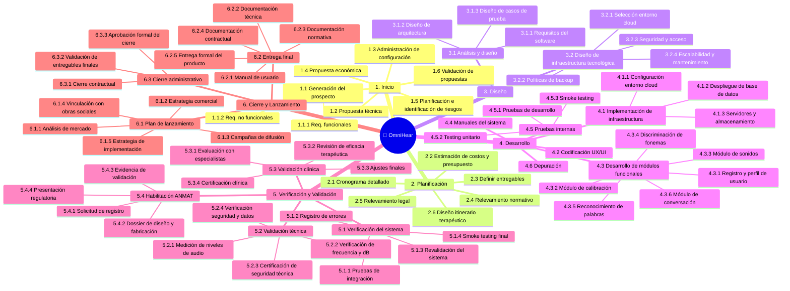

# 🌳 Work Breakdown Structure (WBS)
## Proyecto Incremental OmniHear

---

## Diccionario de la WBS

| ID | Nombre de la tarea | Entregable asociado | Descripción | Criterio de completitud |
|----|--------------------|---------------------|-------------|------------------------|
| 1.1.1 | Definición de requerimientos funcionales | Documento de requerimientos | Relevamiento y documentación de las funcionalidades que el sistema debe cumplir (módulos, interacciones, flujos de usuario) | Documento aprobado por el equipo técnico y el cliente |
| 1.1.2 | Definición de requerimientos no funcionales | Documento de requerimientos | Especificación de atributos de calidad: rendimiento, seguridad, usabilidad, cumplimiento normativo | Documento aprobado junto con los requerimientos funcionales |
| 1.2 | Generación de propuesta técnica | Propuesta del proyecto | Elaboración de la solución técnica propuesta: arquitectura, tecnologías, alcance y metodología de desarrollo | Propuesta entregada y validada por el cliente |
| 1.3 | Administración de la configuración | — | Definición de herramientas y procedimientos para control de versiones, gestión de cambios y trazabilidad de artefactos | Procedimientos documentados y acordados por el equipo |
| 1.4 | Generación de propuesta económica | Propuesta del proyecto | Estimación de costos, honorarios, cronograma económico y condiciones contractuales | Propuesta económica aceptada por el cliente |
| 1.5 | Planificación e identificación inicial de riesgos | — | Identificación temprana de riesgos técnicos, regulatorios y de negocio; definición de estrategias de mitigación iniciales | Registro de riesgos iniciales documentado |
| 1.6 | Validación de propuestas | Acta de constitución | Revisión y aprobación formal de las propuestas técnica y económica por parte de los interesados | Acta de constitución firmada — **Hito** |
| 2.1 | Cronograma detallado (Gantt) | Plan de Gestión Integral | Elaboración del cronograma con todas las tareas, dependencias, duraciones y responsables del proyecto | Cronograma aprobado por el equipo y el cliente |
| 2.2 | Estimación de costos y presupuesto | Plan de Gestión Integral | Desagregado del presupuesto por fase y actividad, con reservas de contingencia | Presupuesto aprobado y baseline establecida |
| 2.3 | Definir entregables | Plan de Gestión Integral | Identificación y descripción de todos los entregables del proyecto con sus criterios de aceptación | Lista de entregables validada por los interesados |
| 2.4 | Relevamiento de normas y regulaciones | Dossier normativo, legal, regulatorio | Identificación de normativas aplicables: ANMAT, ISO 13485, protección de datos, regulaciones de dispositivos médicos | Dossier normativo completo y aprobado |
| 2.5 | Relevamiento legal | Dossier normativo, legal, regulatorio | Análisis de requisitos legales: propiedad intelectual, contratos, habilitaciones y responsabilidad civil | Informe legal validado por asesor jurídico |
| 2.6 | Diseño del itinerario terapéutico | Protocolo clínico | Definición del flujo de rehabilitación auditiva que guiará el diseño de los módulos del sistema | Protocolo clínico aprobado por especialistas — **Hito** |
| 3.1.1 | Requisitos del software | Plan de diseño y pruebas | Especificación técnica detallada de los requisitos de software derivados de los requerimientos del sistema | Documento de especificación de software aprobado |
| 3.1.2 | Diseño de arquitectura | Plan de diseño y pruebas | Definición de la arquitectura del sistema: componentes, módulos, interfaces, patrones y tecnologías | Diagrama de arquitectura revisado y aprobado por el equipo técnico |
| 3.1.3 | Diseño de casos de prueba | Plan de diseño y pruebas | Elaboración de casos de prueba para cada módulo y para la integración del sistema | Plan de pruebas completo y aprobado |
| 3.2.1 | Selección de entorno cloud | Especificación de infraestructura tecnológica | Evaluación y selección del proveedor y servicios cloud (cómputo, almacenamiento, red) | Proveedor seleccionado y justificado documentalmente |
| 3.2.2 | Políticas de backup | Especificación de infraestructura tecnológica | Definición de frecuencia, tipo y retención de copias de seguridad para datos clínicos y de sistema | Política de backup documentada y aprobada |
| 3.2.3 | Seguridad y acceso | Especificación de infraestructura tecnológica | Diseño de controles de acceso, autenticación, cifrado y gestión de identidades | Especificación de seguridad aprobada — cumple normativa de datos de salud |
| 3.2.4 | Escalabilidad y mantenimiento | Especificación de infraestructura tecnológica | Definición de estrategias de escalado horizontal/vertical y plan de mantenimiento de la infraestructura | Especificación de escalabilidad validada — **Hito de diseño** |
| 4.1.1 | Configuración del entorno cloud | Infraestructura tecnológica implementada | Provisión y configuración de los recursos cloud seleccionados (instancias, redes, IAM) | Entorno cloud funcional y accesible por el equipo |
| 4.1.2 | Despliegue de base de datos | Infraestructura tecnológica implementada | Instalación, configuración y prueba del motor de base de datos con los esquemas iniciales | Base de datos operativa con acceso verificado |
| 4.1.3 | Configuración de servidores y almacenamiento | Infraestructura tecnológica implementada | Configuración de servidores de aplicación, almacenamiento de archivos y sistemas de monitoreo | Infraestructura completa operativa |
| 4.2 | Codificación interfaz UX/UI | Prototipo de interfaz | Diseño e implementación de la interfaz de usuario: pantallas, flujos de navegación y componentes visuales | Prototipo funcional aprobado por el equipo de producto |
| 4.3.1 | Módulo de registro y perfil de usuario | Registro funcional | Desarrollo del sistema de registro, autenticación y gestión del perfil audiológico del paciente | Módulo probado: registro, login y edición de perfil operativos |
| 4.3.2 | Módulo de calibración | Ajuste acústico | Desarrollo del módulo que adapta los parámetros de audio (volumen, frecuencias) al perfil auditivo del usuario | Calibración persistida correctamente para cada perfil de usuario |
| 4.3.3 | Módulo de sonidos | MVP: detección sonora | Codificación del módulo de detección y reproducción de sonidos ambientales para entrenamiento auditivo | Detección sonora operativa con umbrales configurables |
| 4.3.4 | Módulo de discriminación de fonemas | Módulo fonético | Desarrollo del módulo de ejercicios de distinción entre fonemas similares | Módulo fonético probado con banco de fonemas cargado |
| 4.3.5 | Módulo de reconocimiento de palabras | Módulo léxico | Implementación del módulo de identificación y comprensión de palabras en contexto auditivo | Módulo léxico funcional con vocabulario base cargado |
| 4.3.6 | Módulo de conversación | Módulo conversacional | Desarrollo del módulo de práctica de comprensión en contextos conversacionales (diálogos, oraciones) | Módulo conversacional probado con escenarios definidos en el protocolo clínico |
| 4.4 | Creación de manuales | Manual del sistema | Redacción del manual técnico del sistema y del manual de usuario final | Manuales revisados y aprobados por el equipo |
| 4.5.1 | Pruebas de desarrollo (caja blanca) | Bitácora de correcciones | Revisión del código fuente y ejecución de pruebas internas por los desarrolladores | Cobertura de pruebas documentada; errores críticos corregidos |
| 4.5.2 | Testing unitario | Bitácora de correcciones | Ejecución de pruebas automatizadas para cada unidad funcional de código | Suite de tests unitarios ejecutada con tasa de éxito ≥ 95% |
| 4.5.3 | Smoke testing (por incremento) | Bitácora de correcciones | Verificación rápida de las funcionalidades principales tras cada incremento de desarrollo | Smoke test aprobado antes de cada entrega parcial — **Hito funcional** |
| 4.6 | Depuración (bug fixing) | Bitácora de correcciones | Corrección de errores detectados en las pruebas internas | Todos los bugs críticos y mayores resueltos y verificados |
| 5.1.1 | Pruebas de integración (caja negra) | Reporte de testing | Verificación del comportamiento del sistema completo e integrado desde la perspectiva del usuario | Todos los casos de prueba de integración ejecutados y aprobados |
| 5.1.2 | Registro de errores | Reporte de testing | Documentación sistemática de los errores detectados durante las pruebas del sistema | Registro de errores completo con severidad y estado de resolución |
| 5.1.3 | Revalidación del sistema | Reporte de testing | Re-ejecución de pruebas sobre los módulos corregidos para confirmar la resolución de errores | Cero errores críticos pendientes; regresión aprobada |
| 5.1.4 | Smoke testing final | Reporte de testing | Verificación final de las funcionalidades nucleares del sistema integrado | Smoke test final aprobado por el equipo de QA |
| 5.2.1 | Medición de niveles de audio | Informe de validación técnica | Medición de los niveles de salida de audio del sistema bajo diferentes configuraciones | Niveles dentro de los rangos establecidos por la normativa vigente |
| 5.2.2 | Verificación de frecuencia y dB | Informe de validación técnica | Comprobación de que las frecuencias y decibelios emitidos cumplen los parámetros del protocolo clínico | Informe de medición aprobado por técnico especializado |
| 5.2.3 | Certificación de seguridad técnica | Informe de validación técnica | Evaluación de riesgos eléctricos, electromagnéticos y de software del dispositivo | Certificado de seguridad técnica emitido |
| 5.2.4 | Verificación de seguridad y protección de datos | Informe de validación técnica | Auditoría de seguridad informática y cumplimiento de normativa de datos de salud (PDPA / Ley 25.326) | Informe de auditoría sin observaciones críticas |
| 5.3.1 | Evaluación con especialistas | Informe de validación clínica/funcional | Sesiones de evaluación del sistema con fonoaudiólogos y otorrinolaringólogos | Informe de evaluación clínica elaborado y firmado |
| 5.3.2 | Revisión de eficacia terapéutica | Informe de validación clínica/funcional | Análisis de los resultados clínicos obtenidos en las evaluaciones con especialistas | Eficacia terapéutica confirmada según métricas del protocolo clínico |
| 5.3.3 | Ajustes finales | Informe de validación clínica/funcional | Incorporación de las observaciones y mejoras indicadas por los especialistas clínicos | Ajustes implementados y verificados por los especialistas |
| 5.3.4 | Certificación clínica | Informe de validación clínica/funcional | Emisión del certificado de validación clínica por parte de los especialistas intervinientes | Certificado clínico emitido y firmado |
| 5.4.1 | Solicitud de registro ANMAT | Expediente de registro de producto médico | Presentación formal de la solicitud de registro del dispositivo médico ante ANMAT | Solicitud ingresada con número de expediente asignado |
| 5.4.2 | Dossier de diseño y fabricación | Expediente de registro de producto médico | Compilación del expediente técnico: especificaciones, planos, procesos y controles de fabricación | Dossier completo entregado a ANMAT |
| 5.4.3 | Consolidación de evidencia de validación | Expediente de registro de producto médico | Recopilación y organización de toda la evidencia técnica, clínica y normativa para el expediente regulatorio | Evidencia compilada y auditada internamente |
| 5.4.4 | Presentación documental regulatoria | Expediente de registro de producto médico | Entrega formal del expediente completo ante ANMAT con toda la documentación requerida | Habilitación ANMAT otorgada — **Hito** |
| 6.1.1 | Análisis de mercado | Plan de marketing y comercialización | Estudio del segmento objetivo, competencia, barreras de entrada y oportunidades comerciales | Informe de mercado aprobado por la dirección |
| 6.1.2 | Estrategia comercial | Plan de marketing y comercialización | Definición del modelo de negocio, canales de venta, pricing y propuesta de valor | Estrategia comercial documentada y aprobada |
| 6.1.3 | Campañas de difusión | Plan de marketing y comercialización | Diseño y ejecución de acciones de comunicación dirigidas a pacientes, profesionales y prestadores de salud | Campaña ejecutada con métricas de alcance definidas |
| 6.1.4 | Vinculación con obras sociales | Plan de marketing y comercialización | Gestión de acuerdos con financiadores de salud para la cobertura del dispositivo | Al menos un convenio firmado con obra social o prepaga |
| 6.1.5 | Estrategia de implementación y adopción | Plan de marketing y comercialización | Plan de onboarding, capacitación y soporte post-lanzamiento para profesionales y usuarios | Plan de adopción documentado y aprobado |
| 6.2.1 | Entrega del manual de usuario | Producto final | Entrega del manual de uso al cliente final, en formato digital e impreso | Manual de usuario recibido y aceptado por el cliente |
| 6.2.2 | Entrega de documentación técnica | Producto final | Entrega de toda la documentación técnica del sistema (arquitectura, código, APIs, infraestructura) | Documentación técnica completa entregada y firmada |
| 6.2.3 | Entrega de documentación normativa | Producto final | Entrega del dossier normativo y regulatorio, incluyendo habilitación ANMAT | Documentación normativa recibida y verificada por el cliente |
| 6.2.4 | Entrega de documentación contractual | Producto final | Entrega de contratos, garantías, licencias y acuerdos de nivel de servicio | Documentación contractual firmada por ambas partes |
| 6.2.5 | Entrega formal del producto | Producto final | Acto formal de transferencia del producto terminado al cliente | Acta de entrega firmada por el cliente |
| 6.3.1 | Cierre contractual | — | Liquidación de contratos con proveedores, subcontratistas y cierre de órdenes de compra | Todos los contratos cerrados y liquidados |
| 6.3.2 | Validación de entregables finales | — | Verificación de que todos los entregables comprometidos han sido aceptados por el cliente | Checklist de entregables completado y firmado |
| 6.3.3 | Aprobación formal del cierre | — | Firma del acta de cierre del proyecto por parte del cliente y el equipo de proyecto | Acta de cierre firmada — **Hito final** |

---

*Cátedra Gestión de Proyectos · FIUNER · 2026*
