# 📅 Cronograma del Proyecto
## Diagrama de Gantt — OmniHear (Incremental)

```mermaid
gantt
    title Cronograma - Proyecto OmniHear
    dateFormat  YYYY-MM-DD
    excludes    weekends

    section 1. Generación del Prospecto
    Definición requerimientos funcionales     :t111, 2026-06-01, 3d
    Definición requerimientos no funcionales  :t112, after t111, 3d
    Generación de propuesta técnica           :t12, after t112, 5d
    Administración de la configuración        :t13, after t12, 3d
    Generación de propuesta económica         :t14, after t13, 4d
    Estimación de costos y presupuesto        :t141, after t14, 2d
    Planificación e identificación de riesgos :t15, after t141, 5d
    Validación de propuestas                  :t16, after t15, 2d
    Hito - Acta de constitución aprobada      :milestone, m1, after t16, 0d

    section 2. Planificación del Proyecto
    Cronograma detallado (Gantt)              :t21, after m1, 3d
    Definir entregables                       :t22, after t21, 3d
    Relevamiento de normas y regulaciones     :t23, after t22, 3d
    Relevamiento legal                        :t24, after t23, 3d
    Diseño itinerario terapéutico             :t25, after t24, 7d
    Actualización matriz de riesgos (I)       :t26, after t25, 1d
    Reunión de Kickoff                        :t27, after t26, 1d
    Hito - Planificación aprobada             :milestone, m2, after t27, 0d

    section 3. Diseño
    Requisitos del software                   :t311, after m2, 4d
    Diseño de arquitectura                    :t312, after t311, 6d
    Diseño de casos de prueba                 :t313, after t312, 4d
    Selección de entorno cloud                :t321, after t313, 2d
    Políticas de backup                       :t322, after t321, 1d
    Seguridad y acceso                        :t323, after t322, 5d
    Escalabilidad y mantenimiento             :t324, after t323, 2d
    Revisión técnica y de diseño              :t33, after t324, 2d
    Hito - Validación del diseño              :milestone, m3, after t33, 0d

    section 4. Desarrollo
    Configuración del entorno cloud           :t411, after m3, 3d
    Despliegue de base de datos               :t412, after t411, 3d
    Configuración de servidores               :t413, after t412, 2d
    Codificación interfaz UX/UI               :t42, after t413, 8d
    Módulo registro y perfil de usuario       :t431, after t42, 4d
    Módulo de calibración                     :t432, after t431, 13d
    Módulo de sonidos                         :t433, after t432, 9d
    Módulo discriminación fonemas             :t434, after t433, 18d
    Módulo reconocimiento palabras            :t435, after t434, 13d
    Módulo conversación                       :t436, after t435, 22d
    Actualización matriz de riesgos (II)      :t437, after t436, 2d
    Creación de manuales                      :t44, after t437, 6d
    Pruebas de desarrollo (caja blanca)       :t451, after t44, 6d
    Testing unitario                          :t452, after t451, 5d
    Smoke testing (cada incremento)           :t453, after t452, 2d
    Depuración (bug fixing)                   :t46, after t453, 7d
    Integración entre módulos                 :t47, after t46, 11d
    Hito - Versión funcional integrada        :milestone, m4, after t47, 0d

    section 5. Verificación y Validación
    Pruebas de integración (caja negra)       :t511, after m4, 8d
    Registro y depuración de errores          :t512, after t511, 3d
    Revalidación del sistema                  :t513, after t512, 5d
    Smoke testing final                       :t514, after t513, 2d
    Medición de niveles de audio              :t521, after t514, 4d
    Verificación de frecuencia y dB           :t522, after t521, 4d
    Verificación técnica seguridad de datos   :t523, after t522, 5d
    Certificación de seguridad técnica        :t524, after t523, 3d
    Evaluación con especialistas              :t531, after t524, 7d
    Revisión de eficacia terapéutica          :t532, after t531, 5d
    Ajustes finales                           :t533, after t532, 6d
    Certificación clínica                     :t534, after t533, 3d
    Solicitud de registro ANMAT               :t541, after t534, 6d
    Recopilación del dossier                  :t542, after t541, 11d
    Consolidación de evidencia de validación  :t543, after t542, 8d
    Presentación documental regulatoria       :t544, after t543, 13d
    Hito - Sistema validado y habilitado      :milestone, m5, after t544, 0d

    section 6. Entrega de Producto Final
    Análisis de mercado                       :t611, after m5, 4d
    Estrategia comercial                      :t612, after t611, 3d
    Campañas de difusión                      :t613, after t612, 5d
    Vinculación con obras sociales            :t614, after t613, 6d
    Estrategia de implementación y adopción   :t615, after t614, 3d
    Entrega del manual de usuario             :t621, after t615, 1d
    Entrega de documentación técnica          :t622, after t621, 3d
    Entrega de documentación normativa        :t623, after t622, 2d
    Entrega de documentación contractual      :t624, after t623, 2d
    Entrega formal del producto               :t625, after t624, 1d
    Hito - Producto final                     :milestone, m6, after t625, 0d

    section 7. Cierre
    Cierre contractual                        :t711, after m6, 2d
    Validación de entregables finales         :t712, after t711, 2d
    Aprobación formal del cierre              :t713, after t712, 1d
    Reunión de cierre y lecciones aprendidas  :t72, after t713, 1d
    Hito - Acta de cierre firmada             :milestone, m7, after t72, 0d
```

## Tabla de Tareas

| ID | Tarea | Duración (días) | Inicio | Fin | Hito |
|----|-------|:--------------:|--------|-----|:----:|
| 1.1.1 | Definición requerimientos funcionales | 3 | 01/06/2026 | 04/06/2026 | No |
| 1.1.2 | Definición requerimientos no funcionales | 3 | 04/06/2026 | 06/06/2026 | No |
| 1.2 | Generación de propuesta técnica | 5 | 06/06/2026 | 11/06/2026 | No |
| 1.3 | Administración de la configuración | 3 | 11/06/2026 | 14/06/2026 | No |
| 1.4 | Generación de propuesta económica | 4 | 14/06/2026 | 17/06/2026 | No |
| 1.4.1 | Estimación de costos y presupuesto | 2 | 17/06/2026 | 20/06/2026 | No |
| 1.5 | Planificación e identificación de riesgos | 5 | 20/06/2026 | 24/06/2026 | No |
| 1.6 | Validación de propuestas | 2 | 24/06/2026 | 26/06/2026 | No |
| **M1** | 🏁 Acta de constitución aprobada | 0 | 26/06/2026 | 26/06/2026 | **Sí** |
| 2.1 | Cronograma detallado (Gantt) | 3 | 26/06/2026 | 29/06/2026 | No |
| 2.2 | Definir entregables | 3 | 29/06/2026 | 02/07/2026 | No |
| 2.3 | Relevamiento de normas y regulaciones | 3 | 02/07/2026 | 05/07/2026 | No |
| 2.4 | Relevamiento legal | 3 | 05/07/2026 | 08/07/2026 | No |
| 2.5 | Diseño itinerario terapéutico | 7 | 08/07/2026 | 15/07/2026 | No |
| 2.6 | Actualización matriz de riesgos (I) | 1 | 15/07/2026 | 16/07/2026 | No |
| 2.7 | Reunión de Kickoff | 1 | 16/07/2026 | 17/07/2026 | No |
| **M2** | 🏁 Planificación aprobada | 0 | 17/07/2026 | 17/07/2026 | **Sí** |
| 3.1.1 | Requisitos del software | 4 | 17/07/2026 | 21/07/2026 | No |
| 3.1.2 | Diseño de arquitectura | 6 | 21/07/2026 | 27/07/2026 | No |
| 3.1.3 | Diseño de casos de prueba | 4 | 27/07/2026 | 31/07/2026 | No |
| 3.2.1 | Selección de entorno cloud | 2 | 31/07/2026 | 02/08/2026 | No |
| 3.2.2 | Políticas de backup | 1 | 02/08/2026 | 03/08/2026 | No |
| 3.2.3 | Seguridad y acceso | 5 | 03/08/2026 | 09/08/2026 | No |
| 3.2.4 | Escalabilidad y mantenimiento | 2 | 09/08/2026 | 10/08/2026 | No |
| 3.3 | Revisión técnica y de diseño | 2 | 10/08/2026 | 12/08/2026 | No |
| **M3** | 🏁 Validación del diseño aprobada | 0 | 12/08/2026 | 12/08/2026 | **Sí** |
| 4.1.1 | Configuración del entorno cloud | 3 | 12/08/2026 | 15/08/2026 | No |
| 4.1.2 | Despliegue de base de datos | 3 | 15/08/2026 | 18/08/2026 | No |
| 4.1.3 | Configuración de servidores y almacenamiento | 2 | 18/08/2026 | 20/08/2026 | No |
| 4.2 | Codificación interfaz UX/UI | 8 | 20/08/2026 | 28/08/2026 | No |
| 4.3.1 | Módulo registro y perfil de usuario | 4 | 28/08/2026 | 01/09/2026 | No |
| 4.3.2 | Módulo de calibración | 13 | 01/09/2026 | 15/09/2026 | No |
| 4.3.3 | Módulo de sonidos | 9 | 15/09/2026 | 24/09/2026 | No |
| 4.3.4 | Módulo discriminación fonemas | 18 | 24/09/2026 | 11/10/2026 | No |
| 4.3.5 | Módulo reconocimiento palabras | 13 | 11/10/2026 | 25/10/2026 | No |
| 4.3.6 | Módulo conversación | 22 | 25/10/2026 | 15/11/2026 | No |
| 4.3.7 | Actualización matriz de riesgos (II) | 2 | 15/11/2026 | 17/11/2026 | No |
| 4.4 | Creación de manuales | 6 | 17/11/2026 | 23/11/2026 | No |
| 4.5.1 | Pruebas de desarrollo (caja blanca) | 6 | 23/11/2026 | 29/11/2026 | No |
| 4.5.2 | Testing unitario | 5 | 29/11/2026 | 04/12/2026 | No |
| 4.5.3 | Smoke testing (cada incremento) | 2 | 04/12/2026 | 05/12/2026 | No |
| 4.6 | Depuración (bug fixing) | 7 | 05/12/2026 | 13/12/2026 | No |
| 4.7 | Integración entre módulos | 11 | 13/12/2026 | 23/12/2026 | No |
| **M4** | 🏁 Versión funcional integrada | 0 | 23/12/2026 | 23/12/2026 | **Sí** |
| 5.1.1 | Pruebas de integración (caja negra) | 8 | 23/12/2026 | 01/01/2027 | No |
| 5.1.2 | Registro y depuración de errores | 3 | 01/01/2027 | 03/01/2027 | No |
| 5.1.3 | Revalidación del sistema | 5 | 03/01/2027 | 08/01/2027 | No |
| 5.1.4 | Smoke testing final | 2 | 08/01/2027 | 10/01/2027 | No |
| 5.2.1 | Medición de niveles de audio | 4 | 10/01/2027 | 13/01/2027 | No |
| 5.2.2 | Verificación de frecuencia y dB | 4 | 13/01/2027 | 18/01/2027 | No |
| 5.2.3 | Verificación técnica seguridad de datos | 5 | 18/01/2027 | 23/01/2027 | No |
| 5.2.4 | Certificación de seguridad técnica | 3 | 23/01/2027 | 25/01/2027 | No |
| 5.3.1 | Evaluación con especialistas | 7 | 25/01/2027 | 02/02/2027 | No |
| 5.3.2 | Revisión de eficacia terapéutica | 5 | 02/02/2027 | 07/02/2027 | No |
| 5.3.3 | Ajustes finales | 6 | 07/02/2027 | 12/02/2027 | No |
| 5.3.4 | Certificación clínica | 3 | 12/02/2027 | 15/02/2027 | No |
| 5.4.1 | Solicitud de registro ANMAT | 6 | 15/02/2027 | 21/02/2027 | No |
| 5.4.2 | Recopilación del dossier de diseño | 11 | 21/02/2027 | 03/03/2027 | No |
| 5.4.3 | Consolidación de evidencia de validación | 8 | 03/03/2027 | 11/03/2027 | No |
| 5.4.4 | Presentación documental regulatoria | 13 | 11/03/2027 | 25/03/2027 | No |
| **M5** | 🏁 Sistema validado y habilitado | 0 | 25/03/2027 | 25/03/2027 | **Sí** |
| 6.1.1 | Análisis de mercado | 4 | 25/03/2027 | 29/03/2027 | No |
| 6.1.2 | Estrategia comercial | 3 | 29/03/2027 | 01/04/2027 | No |
| 6.1.3 | Campañas de difusión | 5 | 01/04/2027 | 06/04/2027 | No |
| 6.1.4 | Vinculación con obras sociales | 6 | 06/04/2027 | 12/04/2027 | No |
| 6.1.5 | Estrategia de implementación y adopción | 3 | 12/04/2027 | 14/04/2027 | No |
| 6.2.1 | Entrega del manual de usuario | 1 | 14/04/2027 | 16/04/2027 | No |
| 6.2.2 | Entrega de documentación técnica | 3 | 16/04/2027 | 18/04/2027 | No |
| 6.2.3 | Entrega de documentación normativa | 2 | 18/04/2027 | 20/04/2027 | No |
| 6.2.4 | Entrega de documentación contractual | 2 | 20/04/2027 | 22/04/2027 | No |
| 6.2.5 | Entrega formal del producto | 1 | 22/04/2027 | 23/04/2027 | No |
| **M6** | 🏁 Producto final entregado | 0 | 23/04/2027 | 23/04/2027 | **Sí** |
| 7.1.1 | Cierre contractual | 2 | 23/04/2027 | 25/04/2027 | No |
| 7.1.2 | Validación de entregables finales | 2 | 25/04/2027 | 27/04/2027 | No |
| 7.1.3 | Aprobación formal del cierre | 1 | 27/04/2027 | 27/04/2027 | No |
| 7.2 | Reunión de cierre y lecciones aprendidas | 1 | 27/04/2027 | 28/04/2027 | No |
| **M7** | 🏁 Acta de cierre firmada | 0 | 28/04/2027 | 28/04/2027 | **Sí** |

---
*Cátedra Gestión de Proyectos · FIUNER · 2026*
