# 📅 Cronograma del Proyecto
## Diagrama de Gantt — OmniHear (Incremental)

```mermaid
gantt
    title Cronograma - Proyecto OmniHear
    dateFormat  YYYY-MM-DD
    excludes    weekends

    section 1. Prospecto
    Def. requerimientos funcionales          :t111, 2026-06-01, 3d
    Def. requerimientos no funcionales       :t112, 2026-06-04, 3d
    Generación de propuesta técnica          :t12,  2026-06-07, 5d
    Administración de la configuración       :t13,  2026-06-13, 3d
    Generación de propuesta económica        :t14,  2026-06-17, 4d
    Estimación de costos y presupuesto       :t141, 2026-06-21, 2d
    Planificación e identificación riesgos   :t15,  2026-06-25, 5d
    Validación de propuestas                 :t16,  2026-06-30, 2d
    Hito - Acta de constitución aprobada     :milestone, m1, after t16, 0d

    section 2. Planificación
    Cronograma detallado (Gantt)             :t21,  2026-07-03, 3d
    Definir entregables                      :t22,  2026-07-07, 3d
    Relevamiento normas y regulaciones       :t23,  2026-07-07, 3d
    Relevamiento legal                       :t24,  2026-07-07, 3d
    Diseño itinerario terapéutico            :t25,  2026-07-07, 7d
    Actualización matriz de riesgos (I)      :t26,  2026-07-15, 1d
    Reunión de Kickoff                       :t27,  2026-07-18, 1d
    Hito - Planificación aprobada            :milestone, m2, after t27, 0d

    section 3. Diseño
    Requisitos del software                  :t311, 2026-07-19, 4d
    Diseño de arquitectura                   :t312, 2026-07-25, 6d
    Diseño de casos de prueba                :t313, 2026-08-01, 4d
    Selección de entorno cloud               :t321, 2026-08-06, 2d
    Políticas de backup                      :t322, 2026-08-09, 1d
    Seguridad y acceso                       :t323, 2026-08-11, 5d
    Escalabilidad y mantenimiento            :t324, 2026-08-17, 2d
    Revisión técnica y de diseño             :t33,  2026-08-20, 2d
    Hito - Validación del diseño             :milestone, m3, after t33, 0d

    section 4. Desarrollo
    Configuración del entorno cloud          :t411, 2026-08-23, 3d
    Despliegue de base de datos              :t412, 2026-08-27, 3d
    Configuración servidores y almac.        :t413, 2026-08-30, 2d
    Codificación interfaz UX/UI              :t42,  2026-09-02, 8d
    Módulo registro y perfil usuario         :t431, 2026-09-11, 4d
    Módulo conversación                      :t436, 2026-09-17, 22d
    Módulo de calibración                    :t432, 2026-09-12, 13d
    Módulo de sonidos                        :t433, 2026-09-27, 9d
    Módulo discriminación fonemas            :t434, 2026-09-12, 18d
    Módulo reconocimiento palabras           :t435, 2026-10-01, 13d
    Actualización matriz de riesgos (II)     :t437, 2026-10-15, 2d
    Creación de manuales                     :t44,  2026-10-18, 6d
    Pruebas de desarrollo (caja blanca)      :t451, 2026-10-25, 6d
    Testing unitario                         :t452, 2026-11-01, 5d
    Smoke testing (cada incremento)          :t453, 2026-11-07, 2d
    Depuración (bug fixing)                  :t46,  2026-11-09, 7d
    Integración entre módulos                :t47,  2026-11-18, 11d
    Hito - Versión funcional integrada       :milestone, m4, after t47, 0d

    section 5. Verificación y Validación
    Pruebas de integración (caja negra)      :t511, 2026-11-29, 8d
    Registro y depuración de errores         :t512, 2026-12-09, 3d
    Revalidación del sistema                 :t513, 2026-12-12, 5d
    Smoke testing final                      :t514, 2026-12-18, 2d
    VACACIONES                               :crit, vac, 2026-12-21, 13d
    Medición de niveles de audio             :t521, 2027-01-03, 4d
    Verificación de frecuencia y dB          :t522, 2027-01-07, 4d
    Verif. técnica seguridad y datos         :t523, 2027-01-08, 5d
    Certificación de seguridad técnica       :t524, 2027-01-15, 3d
    Evaluación con especialistas             :t531, 2027-01-18, 7d
    Revisión de eficacia terapéutica         :t532, 2027-01-27, 5d
    Ajustes finales                          :t533, 2027-02-02, 6d
    Certificación clínica                    :t534, 2027-02-08, 3d
    Recopilación del dossier                 :t541, 2027-02-12, 11d
    Consolidación de evidencia               :t542, 2027-02-23, 8d
    Solicitud de registro ANMAT              :t543, 2027-03-05, 6d
    Presentación documental regulatoria      :t544, 2027-03-11, 13d
    Hito - Sistema validado y habilitado     :milestone, m5, after t544, 0d

    section 6. Entrega Final
    Análisis de mercado                      :t611, 2027-03-12, 4d
    Estrategia comercial                     :t612, 2027-03-17, 3d
    Campañas de difusión                     :t613, 2027-03-21, 5d
    Vinculación con obras sociales           :t614, 2027-03-27, 6d
    Estrategia de implementación y adopción  :t615, 2027-04-04, 3d
    Entrega del manual de usuario            :t621, 2027-04-07, 1d
    Entrega de documentación técnica         :t622, 2027-04-09, 3d
    Entrega de documentación normativa       :t623, 2027-04-13, 2d
    Entrega de documentación contractual     :t624, 2027-04-16, 2d
    Entrega formal del producto              :t625, 2027-04-19, 1d
    Hito - Producto final entregado          :milestone, m6, after t625, 0d

    section 7. Cierre
    Cierre contractual                       :t711, 2027-04-21, 2d
    Validación de entregables finales        :t712, 2027-04-24, 2d
    Aprobación formal del cierre             :t713, 2027-04-26, 1d
    Reunión de cierre y lecciones aprendidas :t72,  2027-04-28, 1d
    Hito - Acta de cierre firmada            :milestone, m7, after t72, 0d
```

## Tabla de Tareas

| ID | Tarea | Esfuerzo (hs) | Duración (días) | Inicio | Fin | Paralela con | Hito |
|----|-------|:---:|:---:|--------|-----|---|:---:|
| 1.1.1 | Definición requerimientos funcionales | 25 | 3 | 01/06/2026 | 03/06/2026 | — | No |
| 1.1.2 | Definición requerimientos no funcionales | 20 | 3 | 04/06/2026 | 06/06/2026 | — | No |
| 1.2 | Generación de propuesta técnica | 40 | 5 | 07/06/2026 | 12/06/2026 | — | No |
| 1.3 | Administración de la configuración | 20 | 3 | 13/06/2026 | 16/06/2026 | — | No |
| 1.4 | Generación de propuesta económica | 30 | 4 | 17/06/2026 | 20/06/2026 | — | No |
| 1.4.1 | Estimación de costos y presupuesto preliminar | 18 | 2 | 21/06/2026 | 24/06/2026 | — | No |
| 1.5 | Planificación e identificación inicial de riesgos | 37 | 5 | 25/06/2026 | 29/06/2026 | — | No |
| 1.6 | Validación de propuestas | 15 | 2 | 30/06/2026 | 02/07/2026 | — | No |
| **M1** | 🏁 Acta de constitución aprobada | — | 0 | 02/07/2026 | 02/07/2026 | — | **Sí** |
| 2.1 | Cronograma detallado (Gantt) | 25 | 3 | 03/07/2026 | 06/07/2026 | — | No |
| 2.2 | Definir entregables | 20 | 3 | 07/07/2026 | 10/07/2026 | 2.3, 2.4, 2.5 | No |
| 2.3 | Relevamiento de normas y regulaciones | 28 | 3 | 07/07/2026 | 11/07/2026 | 2.2, 2.4, 2.5 | No |
| 2.4 | Relevamiento legal | 20 | 3 | 07/07/2026 | 10/07/2026 | 2.2, 2.3, 2.5 | No |
| 2.5 | Diseño itinerario terapéutico | 58 | 7 | 07/07/2026 | 14/07/2026 | 2.2, 2.3, 2.4 | No |
| 2.6 | Actualización matriz de riesgos (I) | 10 | 1 | 15/07/2026 | 17/07/2026 | — | No |
| 2.7 | Reunión de Kickoff | 4 | 1 | 18/07/2026 | 18/07/2026 | — | No |
| **M2** | 🏁 Planificación aprobada | — | 0 | 18/07/2026 | 18/07/2026 | — | **Sí** |
| 3.1.1 | Requisitos del software | 35 | 4 | 19/07/2026 | 24/07/2026 | — | No |
| 3.1.2 | Diseño de arquitectura | 52 | 6 | 25/07/2026 | 31/07/2026 | — | No |
| 3.1.3 | Diseño de casos de prueba | 30 | 4 | 01/08/2026 | 05/08/2026 | — | No |
| 3.2.1 | Selección de entorno cloud | 15 | 2 | 06/08/2026 | 08/08/2026 | — | No |
| 3.2.2 | Políticas de backup | 10 | 1 | 09/08/2026 | 10/08/2026 | — | No |
| 3.2.3 | Seguridad y acceso | 43 | 5 | 11/08/2026 | 16/08/2026 | — | No |
| 3.2.4 | Escalabilidad y mantenimiento | 12 | 2 | 17/08/2026 | 19/08/2026 | — | No |
| 3.3 | Revisión técnica y de diseño | 16 | 2 | 20/08/2026 | 22/08/2026 | — | No |
| **M3** | 🏁 Validación del diseño aprobada | — | 0 | 22/08/2026 | 22/08/2026 | — | **Sí** |
| 4.1.1 | Configuración del entorno cloud | 25 | 3 | 23/08/2026 | 26/08/2026 | — | No |
| 4.1.2 | Despliegue de base de datos | 20 | 3 | 27/08/2026 | 29/08/2026 | — | No |
| 4.1.3 | Configuración de servidores y almacenamiento | 15 | 2 | 30/08/2026 | 01/09/2026 | — | No |
| 4.2 | Codificación interfaz UX/UI | 65 | 8 | 02/09/2026 | 10/09/2026 | — | No |
| 4.3.1 | Módulo registro y perfil de usuario | 35 | 4 | 11/09/2026 | 16/09/2026 | — | No |
| 4.3.2 | Módulo de calibración | 107 | 13 | 12/09/2026 | 26/09/2026 | 4.3.4 | No |
| 4.3.3 | Módulo de sonidos | 73 | 9 | 27/09/2026 | 06/10/2026 | — | No |
| 4.3.4 | Módulo discriminación fonemas | 142 | 18 | 12/09/2026 | 30/09/2026 | 4.3.2 | No |
| 4.3.5 | Módulo reconocimiento palabras | 105 | 13 | 01/10/2026 | 14/10/2026 | — | No |
| 4.3.6 | Módulo conversación | 173 | 22 | 17/09/2026 | 08/10/2026 | — | No |
| 4.3.7 | Actualización matriz de riesgos (II) | 12 | 2 | 15/10/2026 | 17/10/2026 | — | No |
| 4.4 | Creación de manuales | 50 | 6 | 18/10/2026 | 24/10/2026 | — | No |
| 4.5.1 | Pruebas de desarrollo (caja blanca) | 45 | 6 | 25/10/2026 | 31/10/2026 | — | No |
| 4.5.2 | Testing unitario | 40 | 5 | 01/11/2026 | 06/11/2026 | — | No |
| 4.5.3 | Smoke testing (cada incremento) | 15 | 2 | 07/11/2026 | 08/11/2026 | — | No |
| 4.6 | Depuración (bug fixing) | 57 | 7 | 09/11/2026 | 17/11/2026 | — | No |
| 4.7 | Integración entre módulos | 87 | 11 | 18/11/2026 | 28/11/2026 | — | No |
| **M4** | 🏁 Versión funcional integrada | — | 0 | 28/11/2026 | 28/11/2026 | — | **Sí** |
| 5.1.1 | Pruebas de integración entre módulos (caja negra) | 68 | 8 | 29/11/2026 | 08/12/2026 | — | No |
| 5.1.2 | Registro y depuración de errores | 20 | 3 | 09/12/2026 | 11/12/2026 | — | No |
| 5.1.3 | Revalidación del sistema | 40 | 5 | 12/12/2026 | 17/12/2026 | — | No |
| 5.1.4 | Smoke testing final | 12 | 2 | 18/12/2026 | 20/12/2026 | — | No |
| — | 🏖️ VACACIONES | — | 13 | 21/12/2026 | 03/01/2027 | — | No |
| 5.2.1 | Medición de niveles de audio | 29 | 4 | 03/01/2027 | 06/01/2027 | — | No |
| 5.2.2 | Verificación de frecuencia y dB | 33 | 4 | 07/01/2027 | 12/01/2027 | — | No |
| 5.2.3 | Verificación técnica seguridad y protección de datos | 43 | 5 | 08/01/2027 | 14/01/2027 | 5.2.2 | No |
| 5.2.4 | Certificación de seguridad técnica | 20 | 3 | 15/01/2027 | 17/01/2027 | — | No |
| 5.3.1 | Evaluación con especialistas | 58 | 7 | 18/01/2027 | 26/01/2027 | — | No |
| 5.3.2 | Revisión de eficacia terapéutica | 40 | 5 | 27/01/2027 | 01/02/2027 | — | No |
| 5.3.3 | Ajustes finales | 45 | 6 | 02/02/2027 | 07/02/2027 | — | No |
| 5.3.4 | Certificación clínica | 20 | 3 | 08/02/2027 | 11/02/2027 | — | No |
| 5.4.1 | Recopilación del dossier de diseño y fabricación | 85 | 11 | 12/02/2027 | 22/02/2027 | — | No |
| 5.4.2 | Consolidación de evidencia de validación | 65 | 8 | 23/02/2027 | 04/03/2027 | — | No |
| 5.4.3 | Solicitud de registro ANMAT | 47 | 6 | 05/03/2027 | 10/03/2027 | — | No |
| 5.4.4 | Presentación documental regulatoria | 107 | 13 | 11/03/2027 | 25/03/2027 | — | No |
| **M5** | 🏁 Sistema validado y habilitado | — | 0 | 25/03/2027 | 25/03/2027 | — | **Sí** |
| 6.1.1 | Análisis de mercado | 30 | 4 | 12/03/2027 | 16/03/2027 | — | No |
| 6.1.2 | Estrategia comercial | 25 | 3 | 17/03/2027 | 20/03/2027 | — | No |
| 6.1.3 | Campañas de difusión | 40 | 5 | 21/03/2027 | 26/03/2027 | — | No |
| 6.1.4 | Vinculación con obras sociales | 50 | 6 | 27/03/2027 | 03/04/2027 | — | No |
| 6.1.5 | Estrategia de implementación y adopción | 20 | 3 | 04/04/2027 | 06/04/2027 | — | No |
| 6.2.1 | Entrega del manual de usuario | 10 | 1 | 07/04/2027 | 08/04/2027 | — | No |
| 6.2.2 | Entrega de documentación técnica | 20 | 3 | 09/04/2027 | 12/04/2027 | — | No |
| 6.2.3 | Entrega de documentación normativa | 15 | 2 | 13/04/2027 | 15/04/2027 | — | No |
| 6.2.4 | Entrega de documentación contractual | 15 | 2 | 16/04/2027 | 18/04/2027 | — | No |
| 6.2.5 | Entrega formal del producto | 10 | 1 | 19/04/2027 | 20/04/2027 | — | No |
| **M6** | 🏁 Producto final entregado | — | 0 | 20/04/2027 | 20/04/2027 | — | **Sí** |
| 7.1.1 | Cierre contractual | 15 | 2 | 21/04/2027 | 23/04/2027 | — | No |
| 7.1.2 | Validación de entregables finales | 12 | 2 | 24/04/2027 | 25/04/2027 | — | No |
| 7.1.3 | Aprobación formal del cierre | 4 | 1 | 26/04/2027 | 27/04/2027 | — | No |
| 7.2 | Reunión de cierre y lecciones aprendidas | 8 | 1 | 28/04/2027 | 29/04/2027 | — | No |
| **M7** | 🏁 Acta de cierre firmada | — | 0 | 29/04/2027 | 29/04/2027 | — | **Sí** |

---
*Cátedra Gestión de Proyectos · FIUNER · 2026*
